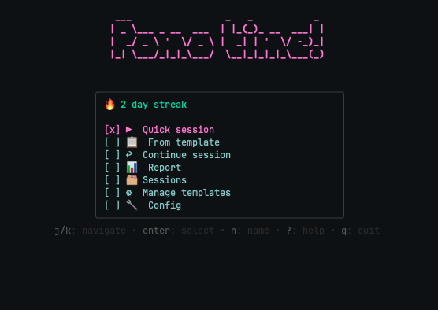

# pomo-time



A terminal pomodoro timer built with Bubbletea. Keyboard-driven, no config required to start.

Forked from [codeanish/pomo](https://github.com/codeanish/pomo-cli), because of its cool loading bar.

---

## Features

- **Template runs** — define multi-interval sequences (e.g. 4×25/5 Pomodoro), run
  them step-by-step; a default "Pomodoro" template is seeded on first launch
- **Streak tracking** — consecutive days with at least one Focus session, shown on
  the home screen
- **Achievements** — milestones tracked in `~/.pomo/achievements.json`; unlocks
  shown on the done screen
- **Session history + reports** — daily/weekly/monthly focus reports with ASCII
  bar charts; session notes surfaced inline
- **Background timer + resume** — press `backspace` mid-session to send the timer
  to the background; a live countdown appears on the home screen; `enter` to resume
- **In-countdown notes** — press `m` during a session to open a note overlay;
  the note is saved with the session on finish or early-end
- **Quick sessions** — pick Focus/Break/Custom from a menu, type any number for a
  custom duration
- **Compact mode** — press `z` to collapse the countdown to a minimal centered box
- **Finish early** — press `f` to end the current interval now; elapsed time is
  logged as the actual duration (minimum 1 min)
- **CSV export** — export sessions by date range; auto-numbered to avoid overwriting


---

## Install

Download the latest release for your Mac from the [releases page](https://github.com/alexgc96/pomo-time/releases/latest):

| Apple Silicon | Intel |
|---|---|
| `pomo-time_Darwin_arm64.tar.gz` | `pomo-time_Darwin_x86_64.tar.gz` |

```bash
tar -xzf pomo-time_Darwin_*.tar.gz
sudo mv pomo-time /usr/local/bin/pomo
```

Optional: install `figlet` for the animated header (falls back gracefully without it).

```bash
sudo port install figlet   # macOS MacPorts
```

**Build from source** (requires CGO for sqlite3):

```bash
CGO_ENABLED=1 go build -o pomo .
sudo mv pomo /usr/local/bin/pomo
```

Launch:

```bash
pomo
pomo --version
pomo -s "Deep Work"    # start with a named session
```

---

## Keys

### Home screen

| Key     | Action           |
|---------|------------------|
| `j`/`k` | Navigate menu    |
| `enter` | Select           |
| `n`     | Name the session |
| `r`     | Open report      |
| `?`     | Help overlay     |
| `q`     | Quit             |

### Countdown

| Key         | Action                           |
|-------------|----------------------------------|
| `p`         | Pause / resume                   |
| `f`         | Finish early (logs elapsed time) |
| `m`         | Open in-session note overlay     |
| `z`         | Toggle compact mode              |
| `n`         | Rename session                   |
| `backspace` | Background timer, return to home |
| `q`         | Quit                             |

### Done screen

| Key     | Action                  |
|---------|-------------------------|
| `j`/`k` | Navigate choices        |
| `enter` | Select                  |
| `m`     | Add / edit session note |

### Report

| Key               | Action                         |
|-------------------|--------------------------------|
| `tab`             | Cycle Daily / Weekly / Monthly |
| `x`               | Export to CSV                  |
| `r` / `backspace` | Close                          |

---

## Config

Stored at `~/.pomo/config.json`. Editable in-app via the Config menu.

```json
{
  "old_session_days": 7,
  "cleanup_enabled": true,
  "csv_export_path": "~/Desktop/pomo-export.csv"
}
```

---

## Data

| Path                        | Contents                                |
|-----------------------------|-----------------------------------------|
| `~/.pomo/sessions.db`       | SQLite — sessions, templates, runs      |
| `~/.pomo/achievements.json` | Achievement unlock timestamps           |

---

## Claude integration (optional)

Disabled by default. Enable via the Config menu (`claude_enabled`, `claude_summaries`).

Requires the `claude` CLI installed and authenticated.

- **Ask Claude panel** — press `c` during countdown for an inline chat panel;
  queries carry session name as context; maintains a conversation thread per session
- **End-of-session summary** — on interval complete, a one-sentence summary is
  generated and shown on the done screen
- **Logging** — all Q&A saved to `claude_queries` in the SQLite database
